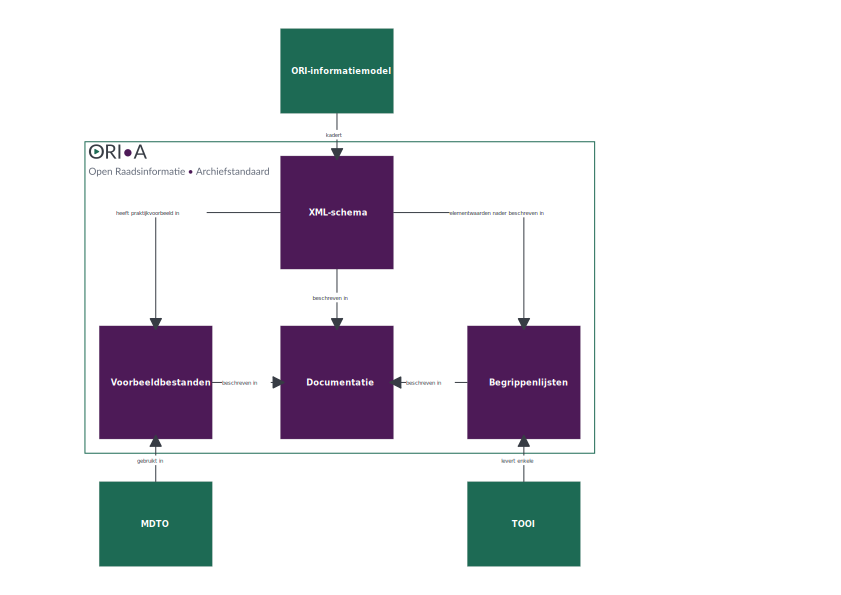

<!-- 
TODO:
- [ ] Denk dat het goed is om in het plan te vermelden dat alle docs in Markdown staan en blijven (en waar ze staan, in zoverre dat nog niet gedaan is)
- [x] pandoc created `--` instead of an actual en-dash. 
  - also, a lot of these en-dashes were inserted at weird places
- [ ] footnotes are messed up. I don't think their content warrants fixing this, though
-->

# Status van dit document

Dit is een levend document dat regelmatig gewijzigd wordt. Wijzigingsverzoeken en feedback zijn welkom.

# Samenvatting

Dit document bevat het lange termijn beheerplan van de open raadsinformatie archiefstandaard (ORI-A). Dit beheerplan bevat... (TODO: opsomming van alle onderdelen)

# Strategie

## Visie

De Open Raadsinformatie Archiefstandaard (ORI-A) beschrijft de regels voor het duurzaam bewaren van raadsinformatie in XML-formaat. Deze regels zijn vastgelegd in het [ORI-A XML-schema](https://ori-a.nl/downloads#xml-schema). Dit schema kan gebruikt worden wanneer raadsinformatie, zoals een collectie videotulen, voor permanente bewaring naar een [e-depot](https://www.nationaalarchief.nl/archiveren/kennisbank/wat-is-een-e-depot) wordt gemigreerd.

ORI-A is gebaseerd op het informatiemodel dat VNG Realisatie heeft ontworpen voor [de Open Raadsinformatie (ORI) API](https://github.com/VNG-Realisatie/ODS-Open-Raadsinformatie). De ORI-standaard van de VNG voldeed echter niet volledig aan de behoeften van archiefdiensten, waaronder [de mogelijkheid tot integratie met MDTO](https://ori-a.nl/hoe-werkt-ori-a#ori-a-mdto-combineren). Hierom is besloten een archiefvariant van ORI te ontwikkelen.

Raadsinformatie wordt doorgaans opgesteld in raadsinformatiesystemen (RIS'en), die momenteel elk een eigen, niet-publiek gedocumenteerd formaat voor raadsinformatie hanteren. ORI-A maakt het mogelijk om deze raadsinformatie op uniforme en publiek gedocumenteerde wijze uit te drukken, waardoor de toekomstige vindbaarheid en interpreteerbaarheid van deze informatie veilig wordt gesteld. Hierin sluit ORI-A aan [bij de hoofddoelstelling van Open Raadsinformatie](https://zoek.openraadsinformatie.nl/):

> om de besluitvorming van decentrale overheden transparanter te maken en een bijdrage te leveren aan de lokale democratie.

ORI-A maakt deel uit van het Open Raadsinformatie-ecosysteem. Dit ecosysteem heeft een zelfversterkend effect: hoe breder het ORI-informatiemodel wordt toegepast, des te beter dat is voor de adoptie van ORI-A, mits ORI en ORI-A soepel in elkaar om te zetten zijn.

### Mission statement

***De Open Raadsinformatie Archiefstandaard is een op het Open Raadsinformatie informatiemodel gebaseerd metagegevensschema voor het duurzaam toegankelijk vastleggen van statische raadsinformatie in XML-formaat,*** ***wanneer*** ***het wordt*** ***gemigreerd naar een e-depot.***

*- een op het Open Raadsinformatie informatiemodel gebaseerd –* ORI-A streeft naar converteerbaarheid naar het ORI-informatiemodel.

\- *metagegevensschema –* ORI-A beschrijft de structuur en regels waar raadsinformatiemetagegevens aan moeten voldoen, en hoe deze metagegevens vervolgens geïnterpreteerd moeten worden.

\- *voor het duurzaam toegankelijk vastleggen van raadsinformatie in XML-formaat –* door ORI-A gezamenlijk met MDTO te gebruiken wordt voldaan aan de eisen ten aanzien van digitale duurzaamheid, zoals die in [de Archiefwet 2026](https://www.nationaalarchief.nl/archiveren/kennisbank/nieuwe-archiefwet-2021) staan vermeld;

\- *wanneer het wordt gemigreerd naar een e-depot –* ORI-A richt zich op statische, blijvend te bewaren raadsinformatie.

### Scope

ORI-A is een domeinspecifiek metagegevensschema voor raadsinformatie. Dit betekent dat ORI-A alleen gegevens definieert die binnen het domein van politieke en bestuurlijke besluitvorming een rol spelen. Het definieert bijvoorbeeld geen metagegevens over informatieobjecten, hoewel deze wel van groot belang zijn bij het raadplegen van raadsinformatie. Voor metagegevens over informatieobjecten wordt aangeraden om [MDTO](https://www.nationaalarchief.nl/archiveren/mdto) te gebruiken. Het gebruiken van ORI-A bij migraties van raadsinformatie naar een e-depot gaat daarom idealiter altijd gepaard met het gebruiken van MDTO.

Bovendien zal ORI-A altijd een XML-vertaling van het ORI-informatiemodel blijven.  Uitzonderingen daarop zijn wijzigingen die ORI-A beter helpen aansluiten bij conventies binnen de Nederlandse archiefsector.

## Governance

ORI-A is ontwikkeld en wordt beheerd door de [Werkgroep Archivering Raadsinformatie](https://ori-a.nl/colofon#werkgroep-archivering-raadsinformatie) (hierna: de Werkgroep). De werkgroep is voorlopig eigenaar van de standaard.

De Werkgroep bestaat uit afgevaardigden van diverse Nederlandse overheidsorganisaties, betrokken bij de duurzame toegankelijkheid van raadsinformatie. Ze hebben als doel de verdere verspreiding en ondersteuning van het gebruik van ORI-A, het onderhouden van contact met betrokken partijen in het ORI-ecosysteem en het onderhouden van de onderdelen van ORI-A.

- Deelname aan de Werkgroep is op uitnodiging, op basis van bewezen affiniteit met en kennis van duurzame toegankelijkheid van raadsinformatie binnen de Nederlandse overheid.

- Bij het maken van beslissingen over ORI-A zijn altijd afgevaardigden van archiefdiensten betrokken.

Er wordt gezocht naar een geschikte beheerder voor de langere termijn, bij voorkeur een partij actief binnen de Nederlandse overheid op het gebied van standaardenbeheer en/of digitale duurzaamheid.

ORI-A bestaat momenteel uit een aantal onderdelen, die door hun aard ieder op een eigen manier wordt beheerd:

- [Een XML-schema](https://github.com/Regionaal-Archief-Rivierenland/ORI-A-XSD)

- [Begrippenlijsten](https://github.com/Regionaal-Archief-Rivierenland/ori-a-begrippenlijsten)

- [Documentatie over ORI-A](https://github.com/Regionaal-Archief-Rivierenland/ORI-A-Website/tree/main/pages)

- [Voorbeeldbestanden](https://github.com/Regionaal-Archief-Rivierenland/ORI-A-XSD/tree/main/Voorbeelden)

Daarnaast beheert de Werkgroep een [KIA-groep](https://kiacommunity.nl/groups/86-videotulen/welcome), om nieuws over de standaard te delen en kennisuitwisseling over videotulen te faciliteren.

## Financiën

De Werkgroep, en daarmee het beheer van ORI-A, kent geen eigen financiering. De bouw, toepassing en ondersteuning van de standaard worden momenteel gedragen door de leden van de Werkgroep, een groep medewerkers van verschillende overheidsorganisaties die daarvoor in de eigen organisaties ruimte hebben gekregen.

Het Regionaal Archief Rivierenland neemt momenteel de kosten voor de domeinnaam `ori-a.nl` voor haar rekening. De website wordt kosteloos gehost ("gepubliceerd") via [Github Pages](Github Pages).

Waar mogelijk wordt het budget van de Werkgroep aangevuld door aangeworven projectfinanciering en/of subsidie(s), bijvoorbeeld bij de realisatie van nieuwe toepassingen van ORI-A. Hiervoor dienen te zijner tijd aanvullende afspraken te worden gemaakt.

# Tactiek

## Community

ORI-A is ontstaan als initiatief vanuit de Nederlandse archiefsector, om te komen tot een gestandaardiseerde en duurzaam toegankelijke manier om raadsinformatie vast te leggen. Het functionele toepassingsgebied is raadsinformatie die voor permanente bewaring wordt aangeboden aan een archiefbewaarplaats, in het kader van (vervroegde) overbrenging volgens de Archiefwet.

Er zijn diverse stakeholders voor ORI-A te definiëren:

**Beheerders van archiefbewaarplaatsen** kiezen ORI-A als metagegevensschema bij het migreren van raadsinformatie naar hun e-depots. Hun belang is dat raadsinformatie eenduidig is beschreven en volgens een vaste procedure kan worden gemigreerd en vervolgens beschikbaar gesteld.

**Informatiebeheerders en griffies bij het verantwoordelijk overheidsorgaan (de archiefvormer)** zijn verantwoordelijk voor het opmaken en beheren van raadsinformatie, in de uitvoering van het politiek/bestuurlijke besluitvormingsproces. Zij maken hiervoor vaak gebruik van een raadsinformatiesysteem (RIS). Hun belang is dat raadsinformatie op een eenduidige manier wordt geregistreerd en gebruikt in haar verschillende contexten: van registreren en beheren in het raadsinformatiesysteem, tot aan actieve openbaarmaking via de ORI API en migreren naar een e-depot via ORI-A. Datastandaardisatie via ORI en ORI-A helpt hen hierbij.

**Leveranciers van raadsinformatiesystemen** leveren de software waarin raadsinformatie wordt aangemaakt en beheerd. Zij leveren de data(structuur) en bestanden die naar ORI-A worden omgezet. In sommige gevallen kunnen zij ook verantwoordelijk zijn voor de conversie naar ORI-A. Hun belang is om te kunnen voorzien in een uniforme wijze om raadsinformatie uit hun systemen te migreren naar een archiefbewaarplaats.

**De Open Raadsinformatie-community** levert verschillende producten en diensten, gericht op het beter toegankelijk maken van raadsinformatie in brede zin. Hierbij kan het gaan om een zoekportaal als <https://openraadsinformatie.nl>, initiatieven om data te standaardiseren zoals het ORI-informatiemodel of gestandaardiseerd te ontsluiten zoals de ORI API. Het is een losse alliantie van overheidsorganisaties, non-profit organisaties en softwareontwikkelaars als VNG Realisatie, Open State Foundation, Ontola en de Werkgroep Archivering Raadsinformatie. Hun belang is dat ORI-A complementair is aan hun eigen initiatieven, zodat ze elkaar versterken.

**Initiatieven gericht op het standaardiseren van overheidsinformatie in Nederland**, zoals MDTO, TOOI en het Gemeentelijk Gegevensmodel (GGM), delen dezelfde doelstelling als ORI-A en hebben hun eigen toepassingsgebied. Hun belang is dat het toepassingsgebied van ORI-A complementair is aan andere standaardiseringsinitiatieven, dat er zo min mogelijk inhoudelijke overlap is met andere metagegevensschema\'s en dat ze waar nodig gezamenlijk ingezet kunnen worden.

## Adoptie

Adoptie van de standaard wordt momenteel op drie manieren ondersteund:

- Door de standaard actief onder de aandacht te brengen via presentaties, lezingen en workshops.

- Door het uitvoeren van pilotimplementaties (migratietrajecten naar e-depots) van ORI-A en MDTO en daarover te communiceren, om zo aan te tonen dat de standaard werkt in de praktijk en leveranciers van raadsinformatiesystemen te voorzien in conversiemiddelen en tips van hun data naar ORI-A (en eventueel MDTO).

- Door geïnteresseerde partijen en gebruikers van ORI-A te informeren en in de praktijk te ondersteunen.

Wanneer de fase van de pilotimplementaties is afgerond, zijn de volgende acties te voorzien om adoptie te ondersteunen:

- Het bouwen en ondersteunen van grafische weergavemogelijkheden van ORI-A.

- Bijdragen aan de doorontwikkeling van de ORI API, op basis van de kernwaarden en ontwerpprincipes van ORI-A. Het doel hiervan is om op zijn minst zichtbaar te maken wat er nodig is om ook raadsinformatie in ORI-A via de ORI API raadpleegbaar te maken. Realisatie van de ORI API en een ORI API – ORI-A koppeling zal het toepassingsgebied van ORI-A vergroten en helpen in de adoptie van de standaard.

- Aansluiting vinden bij het Gemeentelijk Gegevensmodel (GGM).

- Aanmelden van ORI-A, mogelijk samen met ORI, bij het Forum Standaardisatie als één van de open standaarden.

## Rechtenbeleid

ORI-A en haar onderdelen zijn met publieke middelen tot stand gekomen en vrij beschikbaar voor eenieder. Het ORI-A XML-schema, de documentatie en door de werkgroep ontwikkelde software, [zoals de scripts om de documentatie mee te genereren](https://github.com/Regionaal-Archief-Rivierenland/ORI-A-Website), worden beschikbaar gesteld onder de [EUPL-licentie](https://en.wikipedia.org/wiki/European_Union_Public_Licence) (v1.2).

## Architectuur

### Kernwaarden

*Algemene, richtinggevende waarden voor het beheren van ORI-A*

- ORI-A is onderdeel van een open data landschap, waarin het streeft naar samenwerking en wederzijdse bijdragen in plaats van competitie met andere deelnemers.

- ORI-A is een complementair onderdeel van het Open Raadsinformatie landschap.

- Toekomstige interpreteerbaarheid van raadsinformatie is belangrijker dan het kunnen huisvesten van alle raadsinformatie die tijdens het proces kunnen worden vastgelegd. Gegevens die alleen een tijdelijk belang hebben of niet duurzaam te beschijven zijn, worden niet in ORI-A opgenomen. Dat neemt niet weg dat, indien relevant geacht, deze informatie buiten ORI-A alsnog in leveringen kan worden opgenomen.

- ORI-A schikt zich niet naar één specifieke implementatie of toepassing van ORI-A in een informatiesysteem (lees: raadsinformatiesysteem of e-depot).

### Uitgangspunten

*Specifieke, technische uitgangspunten voor het beheren van ORI-A*

- ORI-A is een afgeleide van het ORI-informatiemodel. Dat betekent:

 - ORI-A volgt het ORI-informatiemodel wat betreft inhoudelijke (domeinspecifieke) metagegevens over het politieke/bestuurlijke besluitvormingsproces. Wijzigingsverzoeken aan ORI-A die gaan over deze inhoudelijke metagegevens nemen we pas in behandeling als deze wijzigingen zijn doorgevoerd in het ORI-informatiemodel. Als ze daar nog niet zijn ingediend, verwijzen we door naar de repository van het ORI-informatiemodel.

 - ORI-A gebruikt waar mogelijk dezelfde of vergelijkbare opbouw en naamgeving van klassen en eigenschappen als het ORI-informatiemodel en legt eventuele verschillen duidelijk uit, zodat wederzijdse conversie zo efficiënt mogelijk blijft en zonder informatieverlies.

 - Alleen voor informatie die de duurzame toegankelijkheid van raadsinformatie vergroten, of comptabiliteit met breed gedeelde gewoontes in de archiefsector, mag ORI-A afwijken van ORI. Een voorbeeld is het gebruiken van MDTO voor metagegevens over informatieobjecten. Ook hier geldt dat deze verschillen tussen ORI en ORI-A duidelijk worden uitgelegd.

- ORI-A is zo naadloos mogelijk samen met [MDTO](https://www.nationaalarchief.nl/archiveren/mdto) te gebruiken bij het migreren van overheidsinformatie naar een e-depot. Er is een duidelijke inhoudelijke scheiding tussen de twee metagegevensschema\'s, en voldoende instructies beschikbaar om gezamenlijk gebruik te ondersteunen.

- Het ORI-A XML-schema is primair bedoeld als middel om raadsinformatie in een machineleesbaar formaat (XML) vast te leggen. Wijzigingsverzoeken die een ander doel nastreven kunnen alleen doorgang vinden wanneer de beheerders vaststellen dat het hoofddoel niet negatief wordt geraakt.

- ORI-A hanteert [*single source of truth*](https://en.wikipedia.org/wiki/Single_source_of_truth), zowel in schema-ontwerp als in documentatie. Raadsinformatie en documentatie worden maar één keer en op één plek opgeslagen.

- Documentatie is minstens even belangrijk als technische kwaliteit. Documentatie zorgt voor duurzaamheid. Voor het schrijven van documentatie volgen we de rest van de technische gemeenschap: https://www.writethedocs.org.

- ORI-A beheert zo min mogelijk eigen begrippen en begrippenlijsten, en streeft ernaar deze af te nemen van of onder te brengen bij de Thesauri en Ontologieën voor Overheidsinformatie ([TOOI](https://standaarden.overheid.nl/tooi/doc/tooi-beheerplan)).

### Onderdelen van ORI-A

*Overzichtstekening van de onderdelen van ORI-A en hun onderlinge relaties, plus uitleg*

De architectuur van ORI-A bestaat momenteel uit vier onderdelen:

- Een XML-schema

- Voorbeeldbestanden

- Begrippenlijsten

- Documentatie over ORI-A

De onderdelen hebben afhankelijkheden met producten van enkele stakeholders.

**ORI** (product van VNG Realisatie) kadert het XML-schema.

**MDTO** (product van het Nationaal Archief) wordt mede gebruikt in de voorbeeldbestanden.

**TOOI** (product van KOOP) levert enkele begrippenlijsten.

#### Het XML-schema

Het kernonderdeel van ORI-A is het XML-schema. Het schema beschrijft de entiteiten en elementen die van belang zijn voor het duurzaam toegankelijk archiveren van raadsinformatie.

#### De begrippenlijsten

Binnen het XML-schema bestaat de mogelijkheid om gegevens te relateren aan extern vastgestelde begrippenlijsten. De begrippenlijsten geven nadere beschrijving van enkele elementwaarden uit het ORI-A XML-schema. Waar mogelijk wordt hier verwezen naar begrippenlijsten die in beheer zijn bij specifieke beheerorganisaties als TOOI. Omdat er nog geen vastgestelde begrippenlijsten voor raadsinformatie bestonden, beheert de Werkgroep tijdelijk enkele van zulke begrippenlijsten.

Er zijn echter procedurele en inhoudelijke redenen te noemen waarom deze begrippenlijsten uiteindelijk beter bij een andere beheerpartij kunnen worden ondergebracht:

- Het beheren van begrippenlijsten vereist een heel eigen beheermodel (zie [TOOI](https://standaarden.overheid.nl/tooi/doc/tooi-beheerplan/)) met bijbehorende kennis, handelingen en infrastructuur.

- De begrippenlijsten binnen ORI-A bij uitstek domeinkennis vereisen over het politieke en/of bestuurlijke besluitvormingsproces, en de Werkgroep deze kennis ontbeert, gezien het (momenteel) uitsluitend bestaat uit overheidsinformatie professionals.

- Deze begrippenlijsten algemene relevantie hebben binnen het domein, en dus ORI-A overstijgend zijn.

#### De documentatie

Het derde onderdeel van ORI-A vormt alle documentatie over ORI-A en haar onderdelen, die op de [ORI-A website](https://ori-a.nl) is opgenomen. De documentatie beschrijft alle onderdelen van het XML-schema en geeft relevante informatie aan de verschillende soorten gebruikers, bedoeld om het gebruik van het ORI-A XML-schema zoveel mogelijk te ondersteunen. Beheer daarvan vindt eveneens op [GitHub](https://github.com/Regionaal-Archief-Rivierenland/ORI-A-Website) plaats.

De documentatie valt uiteen in meerdere onderdelen:

- *Over ORI-A* – algemene informatie over nut en noodzaak van de standaard

- *Hoe werkt ORI-A* – inhoudelijke uitleg over hoe je met ORI-A vergaderingen beschrijft; bedoeld om beginners zoveel mogelijk bij de hand te nemen

- *Het XML-schema* – uitputtende en meer formele beschrijving van alle ORI-A entiteiten en eigenschappen

- *Begrippenlijsten* – de aan ORI-A gelieerde begrippenlijsten

- *Veelgestelde vragen* – algemene vragen over ORI-A en hun antwoorden

- *Grafische weergave* – grafische, op UML-geïnspireerde weergave van het informatiemodel

Besluitvorming over wijziging van deze documentatie vindt net als bij het XML-schema plaats op GitHub, volgens dezelfde werkwijzen.

#### De voorbeeldbestanden

Het vierde onderdeel van ORI-A vormen de voorbeeldbestanden, die eveneens op de ORI-A website zijn opgenomen. Zij worden beheerd op dezelfde GitHub repository als de website. De voorbeeldbestanden geven een praktijkvoorbeeld van hoe een levering aan raadsinformatie eruitziet, als deze volgens de instructies van het XML-schema en de documentatie is vormgegeven.

Slechts plaatsing en ordening van het ORI-A XML-bestand in de mappenstructuur ten opzichte van de andere bestanden en mappen in de structuur, valt strikt genomen onder beheer van de Werkgroep. Voor de mappenstructuur en ordening en inhoud van de informatieobjecten wordt de [Submission Information Package (SIP)-instructie van MDTO](https://www.nationaalarchief.nl/archiveren/mdto/specificatie-submission-information-package/structuur) gevolgd. De inhoud van de voorbeeldbestanden (de domeinspecifieke informatie, als ook de informatieobjecten (videotulen en documenten)) is geen onderdeel van de standaard maar dient slechts ter illustratie.

### Normatieve specificatie

Omdat ORI-A als primaire gebruikersgroep de Nederlandse archiefsector voor zich ziet, en deze gewend is te werken met XML in het uitwisselen en migreren van overheidsinformatie, is ORI-A ontworpen als XML-schema (XSD). Het schema vormt de normatieve specificatie van ORI-A. Binnen XSD is breed gebruik gemaakt van mogelijkheden om annotaties en voorbeeldimplementaties op te nemen bij individuele elementen. De documentatie presenteert deze onderdelen in voor mensen leesbare vorm.

### Versiebeleid

Het ORI-A XML-schema is een levende standaard die naar gelang er noodzaak toe is zal veranderen. Gezien comptabiliteit met MDTO en ORI belangrijke waarden zijn voor ORI-A, zullen wijzigingen aan die twee standaarden gevolgd worden en waar nodig leiden tot wijzigingen aan ORI-A. Om ervoor te zorgen dat wijzigingen aan ORI-A niet ten koste zullen gaan van het zijn van een standaard, is het nodig om een zorgvuldig wijzigingsproces en bijbehorend versiebeheer toe te passen op ORI-A.

Alle gepubliceerde versies van ORI-A worden publiekelijk gedocumenteerd en beheerd op de [ORI-A website](https://ori-a.nl/downloads#xml-schema). Hierdoor blijft het mogelijk om te valideren aan het ORI-A XML-schema, ongeacht welke versie een gebruiker bij een implementatie heeft gehanteerd.

De versionering van ORI-A maakt gebruik van een eigen interpretatie van semantisch versiebeheer. Er is een eigen interpretatie gekozen, omdat semantisch versioneren primair is gericht om softwareontwikkeling te ondersteunen, en minder op het onderhouden van een XML-schema. Meer over deze interpretatie is te lezen onder de paragraaf Versiebeheer.

Onderhoud op de standaard vindt plaats door het vier-ogenprincipe te hanteren; minstens twee beheerders moeten akkoord gaan met een wijziging om deze door te voeren. Wijzigingsverzoeken vinden plaats door middel van pull requests. Besluitvorming over versiewijziging van ORI-A vindt plaats binnen vergaderingen van de Werkgroep, waarna een beheerder de nieuwe versie lanceert. Wanneer de beheerders voldoende wijzigingen hebben verzameld en verwerkt om een nieuwe versie te rechtvaardigen, wordt besloten tot het publiceren van een nieuwe versie. Naar gelang de aard van de wijziging wordt het nieuwe versienummer besloten.

## Kwaliteitsbeheer

Het kwaliteitsbeheer van ORI-A is een samenspel van de kernwaarden van ORI-A en de architectuur uitgangspunten. Deze paragrafen informeren de kwaliteit die de beheerders van ORI-A nastreven.

\[Eventueel toevoegen: verwijzing naar operationele hoofdstuk waarin beheer is uitgelegd\]

# Operationeel

## Wijzigingsverzoeken en doorontwikkeling

Eenieder met toegang tot GitHub kan op één van de ORI-A repositories (voor het [XML-schema](https://github.com/Regionaal-Archief-Rivierenland/ORI-A-XSD) of voor de [voorbeeldbestanden, documentatie of begrippenlijsten](https://github.com/Regionaal-Archief-Rivierenland/ORI-A-Website)) wijzigingsverzoeken indienen en issues aankaarten. De beheerders van deze repositories, leden van de Werkgroep, voeren bijbehorende beheertaken uit. Zij doen dit op basis van geldende best practices ten aanzien van repository-beheer en softwareprogrammering.

Naast GitHub hebben externe stakeholders de mogelijkheid om contact te zoeken met de Werkgroep via [KIA](https://kiacommunity.nl/groups/86-videotulen/welcome) of door werkgroepleden direct te benaderen.

Vanuit de Werkgroep wordt contact onderhouden met stakeholders als het Nationaal Archief (MDTO), VNG Realisatie (ORI) en KOOP (ORI en TOOI), om wijzigingen onderling met elkaar af te stemmen en waar nodig veranderingen te initiëren en door te voeren. Dit zodat alle producten met elkaar afgestemd blijven.

## Versiebeheer

Het ORI-A XML-schema houdt een vorm van semantisch versiebeheer aan. Dit betekent dat elk fragment van een versienummer in de vorm `MAJEUR`.`MINEUR`.`PATCH` een speciale betekenis draagt:

- `MAJEUR` wordt verhoogd bij schemawijzigingen die bestaande ORI-A XML niet-valide maken.

- `MINEUR` wordt verhoogd wanneer functionaliteit wordt toegevoegd zonder bestaande ORI-A XML onvalide te maken (ook wel "compatibele wijzigingen"). Dergelijke wijzigingen kunnen er wel voor zorgen dat XML die eerder niet voldeed aan het XML-schema, na de wijziging wél valideert.

- `PATCH` wordt verhoogd bij wijzigingen die geen effect hebben op wat wel of niet als valide ORI-A XML geldt, zoals bij correcties in de documentatie.

Qua procedure volgen we de grote lijnen van het versiebeheer van [TOOI](https://standaarden.overheid.nl/tooi/doc/tooi-beheerplan/#versiebeheer).

Voor majeure en mineure versiewijzigingen is consensus nodig van de Werkgroep, gegeven in een Werkgroepoverleg. Patch-versiewijzigingen mogen zodra er minstens twee beheerders akkoord zijn met de wijziging.

# Implementatieondersteuning

## Opleiding

Met de huidige mate van financiering is er vanuit de Werkgroep geen ruimte om opleidingstrajecten in ORI-A te faciliteren.

Wel worden diverse praktijkvoorbeelden gedeeld op de communicatiekanalen van de Werkgroep, bedoeld om gebruik van ORI-A te ondersteunen en toelichting te geven op diverse implementatiescenario\'s.

## Pilots

In de Werkgroep zijn meerdere leden bezig met pilotimplementaties van ORI-A, met als doel om voorbeeldimplementaties bekend te maken en toekomstige gebruikers en stakeholders te informeren en ondersteunen.

Vanuit de Werkgroep is beperkte ondersteuning beschikbaar richting derde partijen die met ORI-A willen gaan werken. Leden van de Werkgroep zijn beschikbaar om toelichting te geven op hun pilotimplementaties.

## Helpdesk

De ORI-A specificatie en -documentatie is te vinden op [ori-a.nl](https://ori-a.nl/). De Werkgroep biedt op [KIA](https://kiacommunity.nl/groups/86-videotulen/welcome) en op GitHub de mogelijkheid tot het stellen van vragen over ORI-A. Ten slotte kunnen Werkgroepleden direct benaderd worden, bijvoorbeeld via KIA.

## Moduleontwikkeling

De Werkgroep zelf heeft geen intentie om softwarecomponenten te ontwikkelen die ORI-A implementeren. Gebruikers van ORI-A, waaronder deelnemers aan de Werkgroep, worden aangemoedigd om ORI-A ondersteunende software te ontwikkelen, zoals Python bibliotheken of viewers. De Werkgroep volgt daarnaast de ontwikkeling van de ORI API, maar dat is strikt genomen om de onderlinge comptabiliteit te bewaken. Ook is de Werkgroep bereikbaar voor gesprekken met leden uit de community over moduleontwikkeling in relatie tot ORI-A.

## Validatie & certificering

Validatie van de toepassing van ORI-A kan door middel van open source XML-validatietooling te gebruiken. Hiermee kan ook toepassing van MDTO worden gevalideerd.

# Communicatie

## Promotie en publicatie

De Werkgroep promoot ORI-A bijvoorbeeld door middel van nieuwsberichten op KIA, publicaties in vakbladen, presentaties, gebruikersbijeenkomsten en gesprekken met stakeholders en geïnteresseerden.

De standaard en haar onderdelen wordt gepubliceerd op https://ori-a.nl.

## Klachtenafhandeling

Eventuele klachten over het beheer van ORI-A en de afhandeling van wijzigingsverzoeken kunnen worden ingediend op de KIA-pagina. Die zullen worden afgehandeld door de Werkgroep. Er is nog geen escalatiemogelijkheid.

